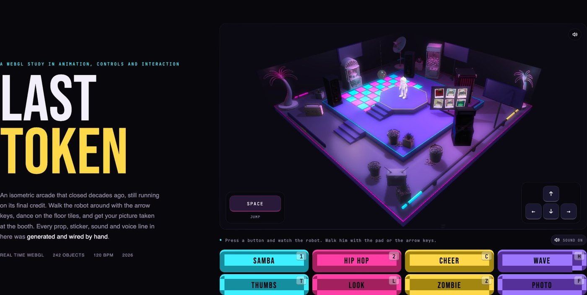
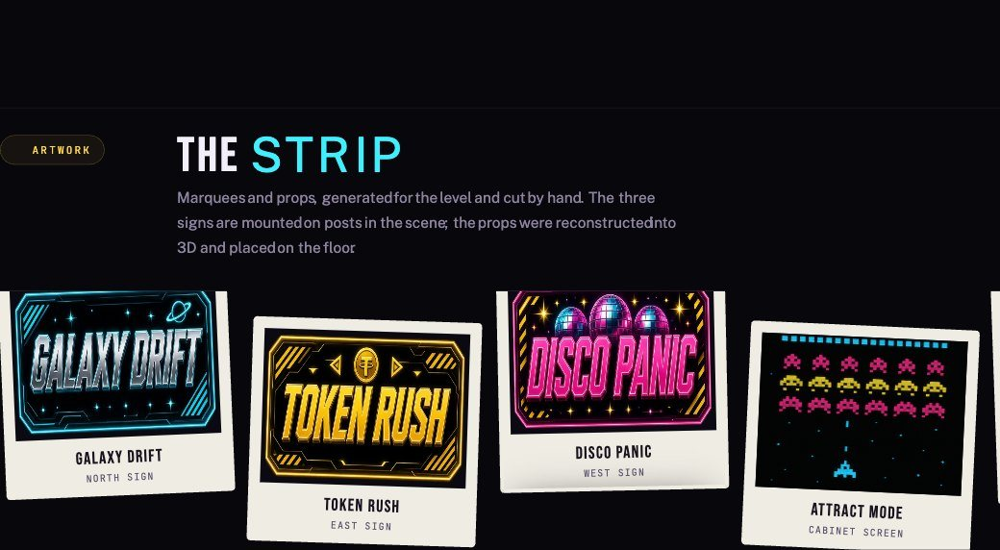

# Last Token

An isometric 1980s arcade diorama that runs in the browser, built in Spline and
driven by WebGL. It is a study in animation, controls and interaction: a robot
you can walk around a neon stage, dance on the floor tiles, and photograph in a
working photo booth.

**Live site:** https://ampenaranda.github.io/last-token/

Made by [Ana M. Penaranda](https://ampenaranda.design).

---

## What is in here

| Path | What it holds |
|---|---|
| `index.html` | The whole website. One file: markup, styles, the Spline loader and the button wiring. |
| `img/` | Poster, marquee art, moodboard and process images the page uses. |
| `assets/props/` | The eleven 3D props as optimized GLBs, the files that were imported into Spline. |
| `assets/audio/` | Fourteen sound effects and announcer lines, all synthesized or spoken by TTS. |
| `assets/refs/` | The Grok Imagine renders each prop was reconstructed from, plus the photo booth strip. |
| `scripts/` | The Python that generated the audio and rebuilt the animation clips. |
| `docs/` | The build log. Everything that was learned, including what did not work. |
| `scene/README.md` | How to republish the Spline scene and point the page at it. |

## Running it locally

The page fetches the scene over http, so opening `index.html` from the file
system will not work. Serve the folder:

```bash
python3 -m http.server 8765
```

Then open http://localhost:8765.

## How the page talks to the scene

The scene is published from Spline and loaded with the Spline runtime rather
than the `<spline-viewer>` element, so the page holds an application object and
the canvas can be sized and driven directly.

```js
const { Application } = await import(
  "https://cdn.jsdelivr.net/npm/@splinetool/runtime@1.9.28/build/runtime.js"
);
await new Application(document.getElementById("scene")).load(SCENE_URL);
```

Every emote already lives inside the scene as a KeyDown event on the robot, and
each one carries the whole performance: a sound effect, an announcer line, the
animation clip, and the timed return to idle. So the buttons do not re-implement
any of that. They press the key.

```js
document.dispatchEvent(new KeyboardEvent("keydown", { key: "1", code: "Digit1", ... }));
```

One dispatch on `document` is enough — the runtime's listener sits above it and
catches the event as it bubbles. Clicking **Samba** and pressing **1** are
therefore the same action, down to the audio, and there is only one copy of the
behaviour to maintain. The earlier approach, invisible hook objects fired with
`emitEvent("mouseDown", ...)`, played the clip but left the sound behind.

| Button | Key | Button | Key |
|---|---|---|---|
| Samba | `1` | Thumbs | `T` |
| Hip Hop | `2` | Look | `L` |
| Cheer | `C` | Zombie | `Z` |
| Wave | `H` | Photo | `F` |

The buttons stay disabled until the scene finishes loading, and the hint line
above them says why. Each button wears its key as a small cap in the corner.

Arrow keys walk the robot and Space makes him jump. Those are Spline's own Game
Control. The pads drawn over the scene — a Space key bottom-left, an arrow cross
bottom-right — hold the same keys down for as long as they are pressed, so
mouse and touch drive him the same way (pointer capture keeps the release
arriving when a finger slides off). Mouse orbit is off (`playControls('none')`)
and the play camera is detached from the Game Control, so the view never moves.
Invisible edge walls with positioned physics keep him on the floor.

**Sound.** The runtime plays through WebAudio. The page wraps `AudioContext`
before the runtime loads, keeps every context it opens, and the Sound buttons
(one in the deck, one in the top-right of the scene) suspend or resume them all
at once. The choice is remembered per browser in
`localStorage`; if storage is unavailable the page simply starts with sound on.

**Layout.** The hero is a two-column grid: title on the left, the scene card
(16:9) on the right with the deck beneath it. A frame wider than the diorama
only adds room at the sides, so widescreen is safe; a frame narrower than it
would crop the palms, because the runtime fills its canvas rather than
letterboxing. The card's width is capped from the viewport height
(`max-width: calc((100svh - 330px) * 1.78)`) so the whole hero, deck included,
fits on the first screen of a laptop. Under 1000px it stacks.

## The page, as a design system



- **Tokens** live on `:root`: ink `#f3effa`, dim `#8d849f`, faint `#8b83a0`
  (raised from `#5d556e` so small mono labels clear 4.5:1 on the background),
  cyan `#3ef0ff`, magenta `#ff3fa6`, gold `#ffd84a`, and the three radii.
  Bebas Neue for display, Space Grotesk for body, JetBrains Mono for labels.
- **Section markers** are coin tags — the site's token mark and a mono label —
  instead of chapter numbers.
- **The artwork is the backdrop.** Three moodboard images drift behind the
  lower page in a fixed layer (blurred, screen-blended, ~15 % opacity), fading
  in after the hero and moving at their own rates as you scroll. Cards carry a
  `data-depth` and drift too; pointer position tilts the polaroids, pins and
  process steps in 3D.
- **Accessibility**: a skip link, visible focus rings on every control, labelled
  pads and toggles, `alt` on every image, and every motion effect (parallax,
  tilt, reveals, the ticker, the coin) switches off under
  `prefers-reduced-motion`.



## Loading

The poster in the scene card (`img/scene/hero-iso.jpg`) is a capture of the live
canvas through the play camera — `canvas.toDataURL()` works on the runtime's
canvas — so it matches the scene exactly and the fade from still to live is
invisible. Regenerate it after any camera or layout change (see
`docs/build-notes.md`, "Poster capture").

Spline's own loading options live in Export → Viewer → **Overview** (Loading,
Loading Preview) and the orbit/pan/zoom, cursor and page-scroll switches in
**Play Settings**. Orbit, pan and zoom are off there; the page keeps its own
poster rather than Spline's loading preview so the two never disagree.

## Changing the scene

Edit in the Spline desktop app, then Export, Viewer, Update Viewer. Copy the URL
at the top of that panel and paste it into `SCENE_URL` near the bottom of
`index.html`. Nothing else needs to change. Full steps in
[`scene/README.md`](scene/README.md).

## How it was made

Four pipelines feed one real-time scene.

- **The robot.** Mixamo clips rebuilt in Blender into a single multi-clip GLB.
  Importing clips as separate files made the engine keep the base hips height,
  so every animation floated above the floor. One file fixed it at the source.
  Eleven clips.
- **The props.** A single-subject reference rendered in Grok Imagine, then
  reconstructed with Tripo image-to-3D at v3.1 Ultra: triangles, 40k cap, 8K
  texture bake exported at 2K, lighting removed from the albedo so the scene's
  own neon does the shading. Then a gentle pass with gltf-transform.
- **The sound.** Every effect is synthesized rather than sampled. The shutter is
  a capacitor whine plus a noise burst, the dance stab is a square-wave
  arpeggio, the soundtrack is a 120 BPM loop of kick, snare, hats, square bass
  and saw arp. The announcer is text to speech directed to sound like a cabinet.
- **The gating.** Trigger zones and conditionals would not fire, so the zones
  became collision pads that move. A pulsing podium and the bouncing dance tiles
  re-touch the robot every beat, set a variable, and that variable is bound
  directly to the effect's geometry. No conditionals anywhere.

Everything that loops runs on the same 120 BPM grid, so the scene pulses with
the music rather than near it.

## The build log

[`docs/build-notes.md`](docs/build-notes.md) is the real record: nine days of
working the Spline editor through its automation bridge, including the failures.
The engine limits that cost the most time are all in there.

- [`docs/game-design.md`](docs/game-design.md) — the level, the stations, the palette
- [`docs/animation-clips.md`](docs/animation-clips.md) — every clip, measured
- [`docs/blender-pipeline.md`](docs/blender-pipeline.md) — Mixamo to Blender to Spline

## Credits

Built with 🪙 and many other tokens of love.
