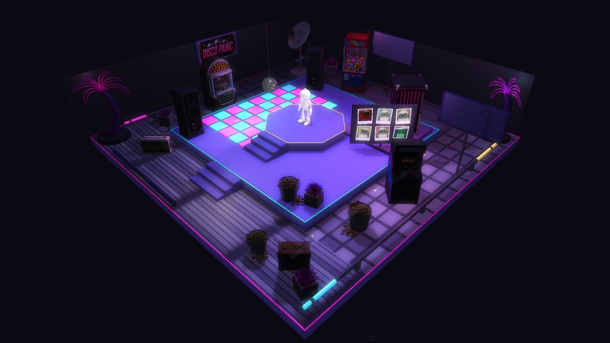
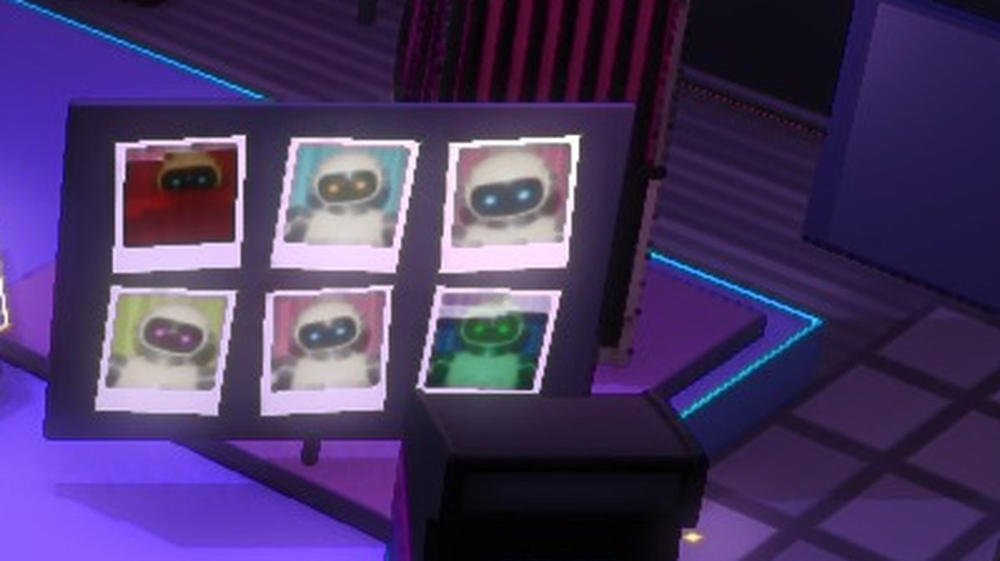
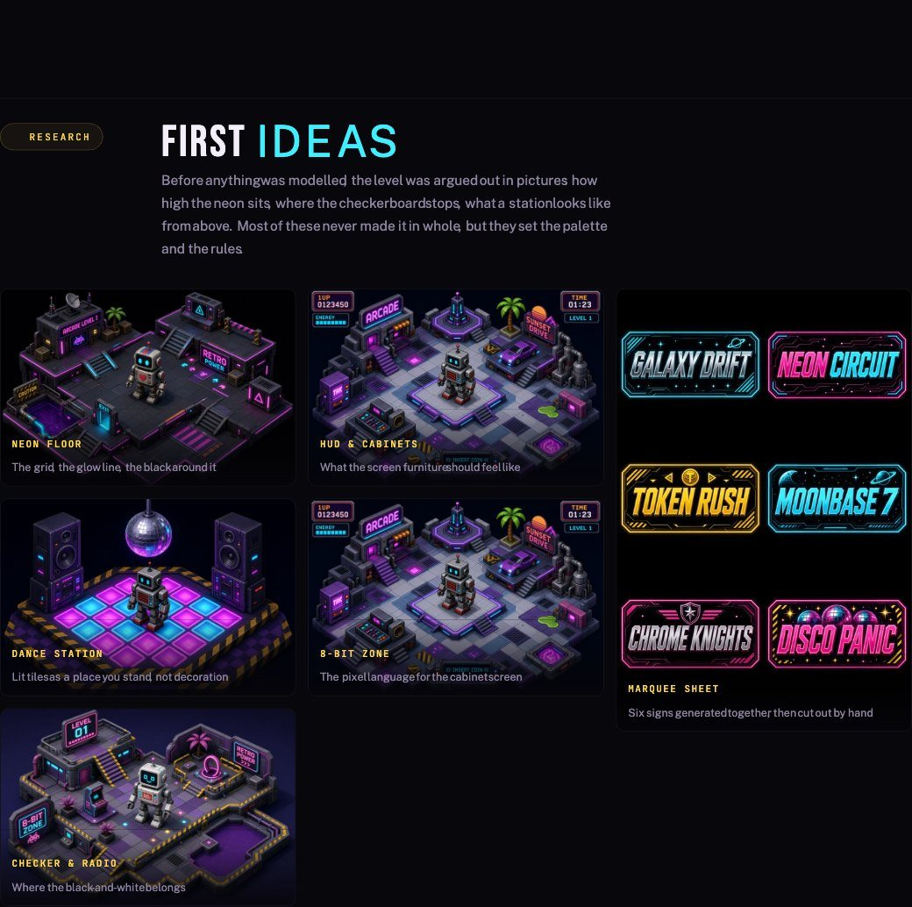
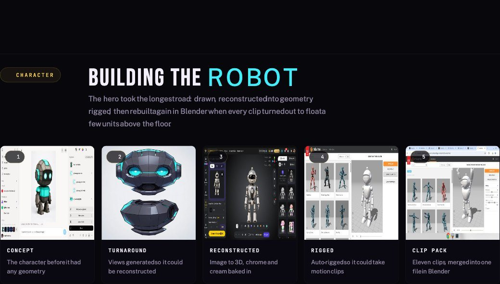
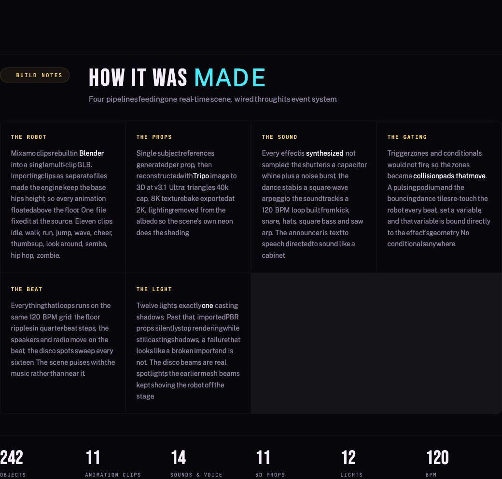
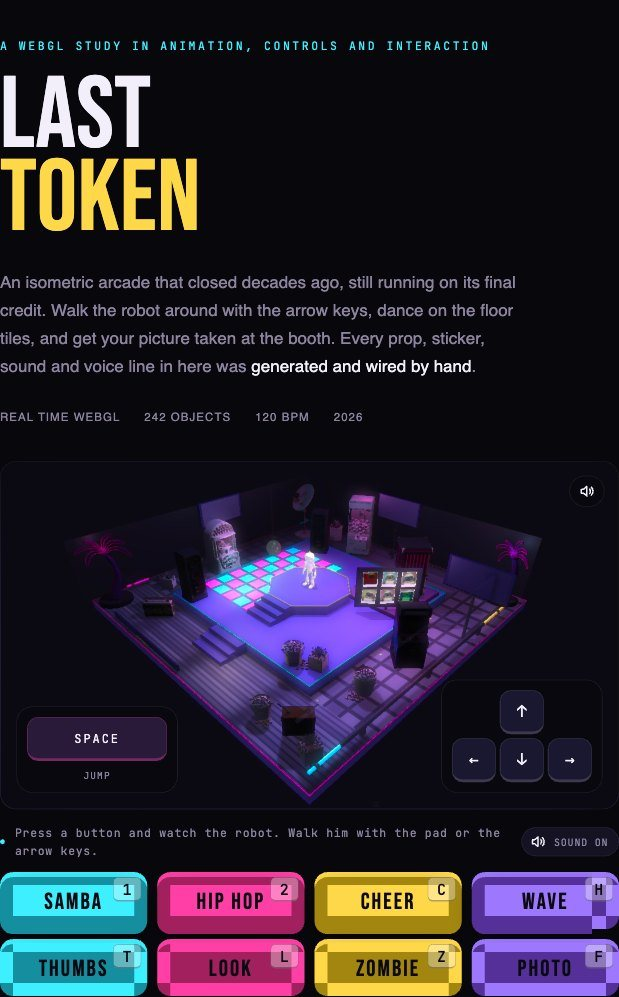
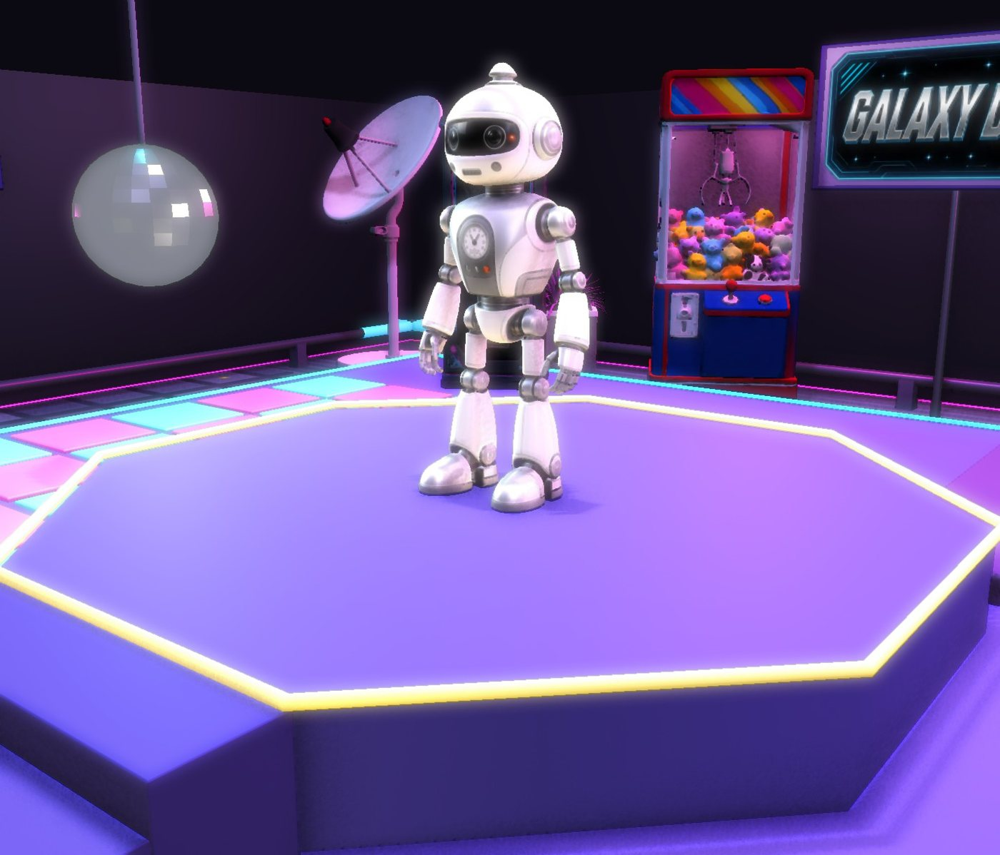
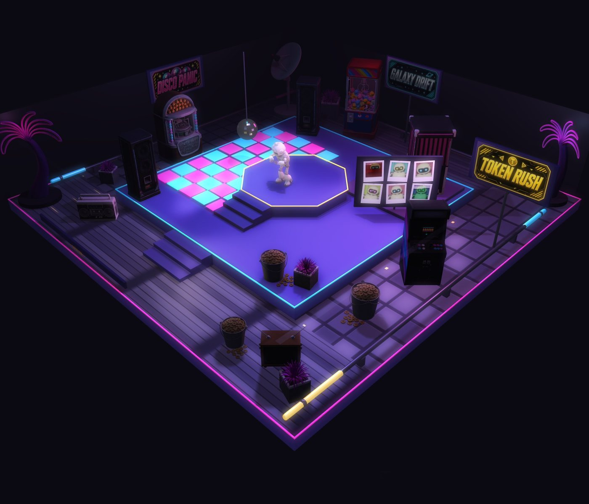

# Spline MCP — Field Notes

Hard-won notes on driving the Spline desktop app through its MCP bridge. Everything here was hit for real during the [[Robot Game — Project Home]] build.

## The big one: Start events hijack everything

**Symptom:** "It only has one animation." Arrows, Shift, Space all do nothing visible — the character just keeps idling.

**Cause:** when you import a GLB with clips, Spline auto-creates a **Start event** with an Animation action playing the first clip on **infinite loop**. That keeps running over the top of every Game Control container, so you only ever see clip #1.

**Fix:** disable the Start event.

```js
updateEvent('<start event id>', { enabled: false });
```

Ana's original robot had this disabled already, which is why it worked there and not on the fresh import. First thing to check on any new import.

## Clips cannot be assigned by name through the MCP

`updateAction(ev, action, { clipId: 'walk' })` **silently stores the literal string `"walk"`** as the clipId. No error. The action is then broken and points at nothing.

Clip IDs are random UUIDs minted per import — there is no pattern, and no MCP read exposes the clip list. `get_objects` only returns clipIds already in use.

**The only reliable route:** assign clips through the app UI (Game Controls → Behavior → On X → Animation → the Animation dropdown), then read the resulting IDs back via `get_objects` to confirm they're distinct.

Once a valid clipId is known, `updateAction` *does* work for re-pointing that action.

## New Animation actions inherit stale clipIds

A freshly created Animation action does not start empty — it picks up some default, and at least once that default was **a clip ID belonging to an already-deleted object**. A dangling reference that looks fine until you test it.

**Always** read back with `get_objects` after creating actions, and check the clipIds are distinct and current.

## `forwardDirection` depends on the import's armature rotation

Two GLBs of the same character imported differently ended up 180° apart:

| Import | Armature rotation | Faces | Correct `forwardDirection` |
|---|---|---|---|
| `robot-mixamo-idle-textured` (original) | `90, 0, 180` | −Z | `-z` |
| Blender-built multi-clip GLB | `90, 0, 0` | +Z | `+z` |

**How to tell without guessing:** point the camera with `lookFrom({ azimuth: -35 })` and look. Camera at azimuth −35 sits in the +Z hemisphere — if you see the robot's *face*, it leads with +Z.

**Wrong value = the character moonwalks** (travels one way, faces the other). Don't rewire the keys; flip this one field.

## Testing movement needs a *held* key, not taps

`app_key` with `count: 100` fires 100 discrete press/release pairs. The character twitches into the move state (enough to see the animation) but **accumulates no net travel** — 200 taps left it at exactly the same spot.

That made direction impossible to judge: the walk clip was playing in place at its rest facing, which *looked* like walking toward the camera.

**Use `hold_key` with a real duration** (display-scope control, needs approval). 1 second at `speedTranslate: 1000` moves 1000 units — unmistakable.

## `get_objects` reads authored state, not play state

Bone transforms come back identical whether or not Play is running. You cannot read the live animated pose through the MCP. Use `play()` + `take_screenshot` and judge visually, or measure the clips in Blender beforehand.

## Play-mode screenshots ignore your camera

While Play runs, `take_screenshot` captures the **play camera**, and `set_view` has no effect. With a follow camera that re-frames as the character moves, carefully staged reference objects drift out of frame. Frame the shot *before* `play()`, and expect it to shift.

## Deleting an object leaves a stale "primary control"

After deleting a robot that held the primary Game Control, the new one shows *"Another Game Control is driving the interactions"* with a **"Use this control instead"** button. Click it, or nothing responds to input. The MCP has no equivalent call.

## Background clicks can stop resolving mid-session

`app_click` resolved dropdowns as `AXPress on AXComboBox` for a while, then started falling through to raw input on `AXWebArea` and stopped opening them. No clear trigger.

**Workaround:** request full-screen control and use `computer_batch` + `left_click`. Also **maximize the Spline window first** (alt-click the green button) — the Edit Event panel is tall and its lower controls fall off-screen in a small window.

## Selection leaks in `run_code`

This sequence silently applied `x: -200` to the **Armature**, not just the rulers:

```js
select(o => o.id === '<armature>');
position({ y: 0 });
select(o => o.name.indexOf('ZZRuler') === 0);
iterate(o => { position({ x: -200, z: 0 }); });   // hit the armature too
```

Re-select defensively and **verify transforms with `get_objects` after any `iterate`**.

## The Z-fighting warning is a useful duplicate detector

When two imports of the same model sit at the same spot, `run_code` returns a `⚠ Z-FIGHTING RISK` naming both mesh IDs. Handy confirmation that you're about to delete the right one.

## Day-two additions (2026-09-17)

### Importing a file through the app (no MCP route exists)

Spline has no File menu. The path is the **≡ menu → Open / Import (⌘O)** → "Import or Drag & Drop" dialog → **3D Model** tile → native file dialog. In the file dialog use **⌘⇧G** to go to a path.

**Typed text into that Go-to sheet drops characters** (`/Usr/aaenrnaDsko/…`) — even in short chunks with pauses. Something on this machine intercepts keystrokes (Wispr Flow is the likely suspect). **Paste instead**: `request_access` with `clipboardWrite`, `write_clipboard(path)`, then ⌘A ⌘V in the field. Same trick for every numeric field (Delay, etc.) — the clipboard is the only reliable text entry here.

### Wispr Flow's invisible overlay blocks clicks

An unlisted Wispr Flow window sits over the **top-left of the screen** (roughly x < 130, y 150–200). Clicks there — the ≡ menu item, the Objects list — are refused. Use keyboard shortcuts (⌘O) or click the robot in the viewport instead.

### Getting the right-hand panel to show an object's events

`run_code select(...)` alone does **not** refresh the app's inspector if nothing was selected in-app. The sequence that works: click the robot in the viewport (selects a child) → `select()` the root via MCP → **wait ~2 s** → then click events. Switching Preview → Edit clears the selection, so repeat after every play-test.

### Every new Animation action defaults to the first clip alphabetically

Not idle — whatever sorts first. In v3 that's `cheer`, so even **On Idle** needed assigning. A useful side effect: reading that default ID off any action gives you one clip ID for free.

### Setting `object` and `clipId` in one `updateAction` breaks the clip

`updateAction(ev, a, { object, clipId, delay })` left every action pointing at **`82912c35…`, the idle clip of a robot deleted two days earlier**. A second call with `{ clipId }` alone fixed it. Always set clipId on its own, then read back.

### `delay` and loop are not writable (or readable) through the MCP

`updateAction(..., { delay: 2.95 })` silently did nothing; `get_objects` never shows delay, loop, or cycle. UI only — Delay via clipboard paste, Loop via its dropdown (None / Count / Infinite).

### A finished clip freezes on its last frame — always

Loop None, Count 1, and Mode Toggle all leave the character holding the final pose until another animation starts. Nothing hands back to idle on its own. **Fix that works:** a second Animation action on the same Key Down playing `idle` (Loop Infinite) with `Delay = clip length + 0.05`. Verified: C → cheer → idle at ~3 s. Movement overrides any emote, verified.

Edge case: the delayed idle fires even if the player started walking meanwhile, and then stomps the walk until they release and re-press. Short emotes make this negligible; 15–20 s dances don't.

### Dropdown geometry that held all day (maximized window)

Key Down panel: Animation action row **(1201, 218)**, clip dropdown **(1263, 271)**, Delay field **(1252, 304)**, Loop dropdown **(1263, 319)**. The clip list opens *downward* from the dropdown row with 14.1 px spacing, so clip *k* (alphabetical index) is at `271 + 14.1·k`. Six emote assignments landed first try from that formula — zoom after each pick to read Start/End and confirm.

### Updated re-import checklist

1. ≡ → Open / Import (⌘O) → 3D Model → paste path
2. `applyMaterial('Robot Texture')` on the new mesh; `position({ y: 10 })`; delete the old robot; `rename`
3. **Disable the new Start event**
4. `addEvent('GameControl')` + settings + four Animation actions; Key Down events + one Animation each
5. Click **"Use this control instead"**
6. UI: assign every clip (On Idle included), Loop = Count 1 on emotes
7. For emotes: second Animation action → idle (clipId-only update), paste Delay in the UI
8. `get_objects` → every clipId distinct and current
9. Play-test with **held** keys and timed screenshots

## Day-three additions (2026-09-17, building the level)

### `delay` is milliseconds
`updateAction(..., { delay: 2950 })`. My earlier `delay: 2.95` silently did nothing. Once set, it reads back through `get_objects` as `"delay": 2950` — so the field *is* exposed after all, just in ms. Loop/count still aren't.

### Conditional actions can't be nested from this bridge
`addAction(ev, 'Conditional')` + `updateAction(..., { condition: [{id}, {name:'=='}, {name:'1'}] })` works on Key Down. But every signature for a child under its branch — the documented `{ parentActionId, branch }` object as arg 3, as arg 4, and `(ev, type, parentId, 'if')` — was refused. Use a **Conditional event** instead: `addEvent('Conditional')`, `updateEvent(ev, { condition: [...] })`, actions in the `'in'` / `'out'` containers. Same effect, fully wireable.

### Gate pattern that works: variable hand-off
Key → `SetVariable target = source` (expression `[{ id: sourceVarId }]`) → a Conditional event elsewhere watching `target == 1` → its `in` actions do the work and a delayed `SetVariable target = 0` re-arms it. Trigger zones set the source variable when the robot stands somewhere.

### Every new Transition gets a stray 1 s base tween
Same as day one: `addAction(..., 'Transition')` seeds a `state: null, 1000 ms` tween before yours. `removeTween` it or the flash waits a second.

### Text primitive: the box, not the glyphs
`fontSize` ≈ glyph height in units (not the giant numbers the creation report claims — those are pre-font-load). The text lives in a **box** (`geometry({ width, height })`) anchored **top-left at the object's position**; a narrow box word-wraps into a column. Size the box to the text and centre by hand: `x = centre`, `y = centre − height/2`. The Bebas Neue cut is `'Bebas Neue_regular'`.

### Aiming a camera object: XYZ Euler order
A camera at `(d·cos e·sin a, h + d·sin e, d·cos e·cos a)` does **not** aim with `rotation({ x: -e, y: a })` — the pitch comes out shallow. For XYZ order the forward vector is `(-sin y, cos y·sin x, -cos y·cos x)`, so solve: `y = asin(-fx)`, `x = asin(fy / cos y)`. For the 45°/35° iso view that gave `rotation({ x: -45.5, y: 35 })`. Verify with `play()` + screenshot — that view *is* the play camera.

### Isometric follow camera — confirmed
A `PerspectiveCamera` object, `setPlayCamera(cam)`, `updateEvent(gc, { camera: cam.id, cameraXAxis: 'Locked', cameraYAxis: 'Locked' })`. Whole slab in frame, character centred, no orbit. Orthographic never needed.

### Torus sizing
`geometry({ radius })` did nothing; `geometry({ width, height, depth })` (outer diameter ×2, tube) did. Read `size` back to be sure.

### Trigger zones
`updateEvent(trig, { target: 'custom', triggeringObjects: [robotId], triggerZone: 'box', size, position, rotation, helperVisible })` on a host that already has positioned physics. Fires on enter only — put a second trigger where the state should reset.

### The library has an `'arcade'` asset, no `'jukebox'`
`object('arcade')` imports something (not yet inspected); `object('jukebox')` throws.

### Pulling auth-gated images out of the built-in browser (Grok)
`curl` on `assets.grok.com` returns 403 — the assets are session-gated. But a `javascript_tool` call **inside** the grok.com page can `fetch(url, { credentials: 'include' })` (200 OK) and return the bytes as data URIs. Any result over the token cap is auto-saved to `~/.claude/projects/<project>/<session>/tool-results/<call>.txt` as `[{type, text}]` JSON; decode with Python (`re.findall(r'data:(image/\w+);base64,([A-Za-z0-9+/=]+)')` → `base64.b64decode`). Full-resolution originals, zero tokens spent on the pixels. Works for the gallery `` elements too, which are already data URIs.


## Day 4 — Tripo props (2026-09-17)

- **Light ceiling is really a SHADOW-MAP ceiling.** Every shadow-casting light costs a texture unit; the Tripo PBR material (basecolor + roughness/metal + normal + env) then runs out and its shader fails silently: the mesh vanishes but still casts a shadow. Editor broke at 10 lights (all shadowed), the **play runtime broke earlier (9)** — it has less headroom. Fix: `updateLight({ shadows: false })` on every fill/practical, ONE shadow caster (Top Fill). With that, 10 lights rendered fine in editor and runtime. Key name is `shadows`, not `castsShadows` (that's only the analyze_scene report field).
- **Prop pivot is at the BASE, not the centre.** Verified from a side view: `position({ y: floorTop })` grounds a Tripo import (tier 1 top = 10, tier 2 top = 130). My first pass used `floor + h/2` and everything floated.
- **`addState()` returns nothing usable** — read the new state id back with `get_objects`, then `updateTween(ev, action, tween, { state })`. Same for `addEvent` (id via get_objects). `addAction(ev, 'Transition', 'actions')` does return `{actionId, tweenId}`, plus the usual stray 1 s base tween to `removeTween`.
- **`select(fn)` only walks top-level objects** — a child mesh (tripo_node_…) can't be reached by predicate or by name from run_code; `getGeometry()` on imports is therefore off the table. Use `get_objects` / the side-view trick instead.
- **Tripo fronts point −Z**: yaw −135 faces the iso camera at (+x,+z); 180 faces +z; −90 faces +x.
- **Material convergence**: `select('Tile 1-1'); createMaterial('Tile A'); select(o => …); applyMaterial('Tile A')` — 68 one-off materials → 21 in one call, look unchanged. analyze_scene flags cyan tile == cyan neon as "duplicated" — left split so per-tile states stay independent.
- **Play-mode screenshots**: while `play()` runs, every `take_screenshot` returns the play camera (aiming fields ignored) — that's the honest runtime check. `stop()` after.
- **Point-light ceiling: 9.** With 10 point lights active, every imported PBR mesh (the Tripo GLBs — physical material with normal + roughness/metal maps) silently stops rendering: they still cast shadows on the floor but the mesh itself is gone, in the editor and in `take_screenshot({view:'live'})`. Primitives with simple materials keep rendering, so it looks like an import bug. 9 lights is fine. Hidden lights don't count. Budget the practicals; use emissive materials for the rest.
- **GLB import normalises to 500 units on the longest axis**, pivot at the bounding-box centre, hierarchy = `Empty` (named after the file) → `tripo_node_…` mesh. So `y = floor + h·scale/2`. The robot is 500 tall, so a 1.0 import is "robot-sized".
- **`duplicate()` exists** in the DSL: `select('X'); duplicate(); rename('Y'); position(...)` — the copy is auto-selected. Cheaper than a second ⌘O import (and the second speaker/palm came from it).
- **Import needs full-screen control.** The native Open panel ignores background `app_key`/`app_type` (⌘⇧G never opened, the search field stayed empty). Working recipe: `app_release` → `open_application('com.design.spline')` → `computer_batch`: click viewport → ⌘O → 3D Model tile (754,354 in the 1456×819 frame) → ⌘⇧G → ⌘A ⌘V (path from `write_clipboard`) → Return → click **Open** at (944,527) (Return alone doesn't fire Open when the search field has focus) → wait ~12 s. Re-write the clipboard right before each paste — a page copy handler in the browser overwrote it once.
- `select(o => o.name.startsWith('Speaker Cone')); hide();` hides a whole run by name — handy for stand-ins.
- Tripo settings and results live in [[Game Design — Last Token]] → Asset pipeline.


## Day 4b — gates, keys and play-testing (2026-09-17)

- **Play-testing IS possible now.** Editor toolbar Preview tab (1456×819 frame: Edit (246,54), Preview (210,54)), click the viewport to focus, then hold keys with a HID-level Quartz event from Bash — `osascript key down` and computer_batch taps do NOT move the character (taps only rotate it):
  ```python
  import Quartz, time
  def hold(keycode, secs):
      Quartz.CGEventPost(Quartz.kCGHIDEventTap, Quartz.CGEventCreateKeyboardEvent(None, keycode, True))
      time.sleep(secs)
      Quartz.CGEventPost(Quartz.kCGHIDEventTap, Quartz.CGEventCreateKeyboardEvent(None, keycode, False))
  hold(124, 2.0)   # → 123 ←, 126 ↑, 125 ↓ ; 800 units/s at speedTranslate 800
  ```
  Single keys (f, 1…) via computer_batch `key` are fine. Zoom the viewport right after the key to catch a 200–350 ms flash. The preview takes ~10 s to load after clicking Preview (black frame first, then untextured props, then done).
- **`play()` from the MCP runs a SEPARATE runtime** — `take_screenshot` shows it, the editor window does not, and your keystrokes go to the window. For key-driven tests use the Preview tab; use `play()` only for screenshot-only checks (props rendering, etc.).
- **Conditional EVENTS never fire in the runtime** (tested on a light and on a mesh with a variable that provably changed). **Nested Conditional ACTIONS are refused by this bridge** (`addAction(ev, 'Transition', { parentActionId, branch: 'if' })` → "argument #3 must be string", though the dsl-reference documents it). So there is currently no way to gate an action on a variable from run_code. Workarounds: bind the variable to geometry (`bindVariable('width', varId)` on a flash plane: 0 = invisible) and set/reset it with two SetVariables (the second with `delay`).
- **Trigger zones did not fire either** — hosted on Tier2 Platform and on the booth itself, with `physics({friction:0.5})` on the Robot as game-controls docs require, `target:'custom'` + triggeringObjects [robot]. The robot also walked straight THROUGH a `physics({type:'positioned'})` Tripo prop. Something about physics on this page is off — check the page Simulation panel and the Robot's Physics panel in the UI. Open item.
- **SetVariable works**: `updateAction(ev, a.actionId, { variableId, expression: [{ name: '2' }] })` (literal) and `[{ id: otherVarId }]` (copy). Verified with a readout.
- **Variable readout for debugging**: `mesh('Text', {...}); bindVariable('text', varId)` — live in Preview. Two hidden ones stay in the scene: `Debug Station`, `Debug BoothHit`.
- **Transition flash idiom**: one tween to the state with `repeat: 1, direction: 'pingpong'` goes there and back (no return tween needed). `state: null` in a tween = Base State — that is what the stray 1 s tween is.
- **A Transition created by addAction already targets the object's first state** if you don't pass `state`; passing `state: undefined` wipes it to null (the speaker-thump bug).
- **Two-tween flash idiom (pop + decay)**: `updateTween(ev, act, tw, { state: S, duration: 80, repeat: 0, direction: 'normal' })` then `addTween(ev, act, { state: null, duration: 700, delay: 90, easing: 'ease-out' })` — snaps to the state and eases back to Base. Reads far better than a ping-pong for lights. `addTween` exists and works.
- **Tween state auto-assignment is unreliable**: sometimes a new Transition's tween points at the object's first state, sometimes it stays `null` (Flash Card did). Always read it back with get_objects and set `state` explicitly.
- **A press counter is the cheapest "did the key fire" test**: `SetVariable` with `expression: [{ id: v }, { name: '+' }, { name: '1' }]` on the key, a Text bound to `v`. Saved a wild-goose chase — F had been firing all along; the effect was just 200 ms of a 4% scale change.
- **Keys go to the toolbar after clicking Preview.** Click the viewport once, then press keys. (Same reason the user's F "didn't work".)
- **XYZ Euler skew**: a plane with `rotation({x:-12, y:45})` looks twisted from the front — with yaw applied after pitch the tilt becomes a roll. Keep decal planes at `x:0`.
- **Tripo fronts vary per model**: booth = −Z (yaw −135 faces the iso camera), cabinet/CRT/boombox = +Z (yaw 45). Screenshot the front before trusting a rotation.

## Day 5 — sound, spots, movers (2026-09-17, late)

- **Sound pipeline that works**: synthesize SFX with numpy → 16-bit WAV (camera click = noise burst + capacitor whine sweep; 8-bit stab = square-wave arpeggio; synthwave loop = kick/snare/hats + square bass + saw arp at 120 BPM, 8 s), announcer lines with OpenAI TTS (`gpt-4o-mini-tts`, voice `ash`, `response_format: 'wav'`, an "arcade announcer" instruction). Files in `RobotGame/build/audio/`. Script lives in the transcript — worth saving to `scripts/make-sfx.py` next time.
- **Import audio with ⌘O → Sound tile (876,338 in the 1456×819 frame) → ⌘⇧G path → Open.** They become audio ASSETS (not objects); `analyze_scene` counts them, `get_scene` doesn't list them.
- **Audio actions can't be assigned from run_code** — `addAction(ev, 'Audio')` creates the slot, `updateAction` accepts anything silently, and get_objects shows no asset field. Assign in the UI: select the object → Events → click the event row → Edit Event popover → click the Sound row → the ⁝⁝ icon left of "Upload" opens **Audio Assets** (Local Audios lists the imports) → click one. Same popover: Volume, Delay (seconds), Loop None/Count/Infinite, and for Start events "After: Any input" (browser autoplay rule — the loop starts on the first click/key).
- **Every visible mesh is a physics body, and an animated one is a kinematic mover that SHOVES the game character.** The rotating disco-beam bars knocked the robot off the centre platform during Preview. Anything that animates near the player must stay out of its volume (tilted the beams up) — or be hidden, since `physics({enabled:false})` is not available from the DSL.
- **SpotLight via `add('SpotLight')`** + `updateLight({ angle, penumbra, distance, intensity, shadows:false })`, aimed with `rotation({x:-55})` and a y-rotation state for the sweep. At intensity 6 they washed the whole floor pastel; 2.2 reads as coloured pools. Light count 8 (1 shadow caster) — still fine.
- **Colour in states works on per-object materials**: `selectState('Alt'); color(...); shading({emissive})` — that's why the new floor tiles got their own materials again (40 tiles, `Tile r-c`, 0-indexed). Shared material assets would have changed all tiles at once.
- **GameControl containers take Audio actions**: `addAction(gc, 'Audio', 'move')` / `'jump'` — assign the file in the UI under Game Controls → Behavior → On Move / On Jump (the popover is long: scroll inside it). A looping file in `move` stops on its own when the key is released — free footsteps.
- **`Follow` event on a light**: `add('PointLight'); const f = addEvent('Follow'); updateEvent(f, { target: robotId })` — a stage light that tracks the player. (Verify in Preview; Follow is a runtime tracker.)
- **Mesh beams near the player are always a trap** — replaced with `SpotLight`s entirely; lights never push the character.
- **If another app steals the front (Outlook did), display-scope clicks fail safely** with a "would land on X" error — `open_application('com.design.spline')` and retry.
- Sound pipeline is now a script: `RobotGame/scripts/make-sfx.py` (numpy SFX + loop, OpenAI TTS lines; OpenAI has no SFX endpoint — voices only).
- **`select('file.png')` by import name** works for image imports (the object is named after the file).

## Day 6 — the gate that finally works (2026-09-17, night)

**Zone gating without Conditionals or Triggers** — the pattern that survived every test:

1. **Detection = `Collision` events (target `'character'`) on things the robot STANDS ON — but only movers re-fire.** A static pad never fired (walk-on, jump-on, drop-on all 0). A pad with a Start ping-pong on its Y (±14, 250 ms) fires on every cycle while the robot stands on it — kinematic movers re-establish contact. The bouncing dance tiles fire for the same reason. Big static bodies only fire on a real landing (stepping DOWN from the octagon onto tier 2 fired; that's the reset).
2. **State = plain variables set by those collisions**: `atBooth` (−4000 idle / 900 on the podium), `atDance` (0 / 40 on the tiles). Tier 2 and the centre octagon set both back to idle on contact.
3. **Effect = a geometry/transform BINDING, not a Transition**: `Flash Light.position.y` is bound to `flashY`, `Rim Glow.depth` (a torus's thickness — NOT `tube`, which did nothing) is bound to `rimGlow`. The key copies the zone variable into the effect variable (`expression: [{ id: atBooth }]`) and a second SetVariable with `delay` puts it back. Idle values are chosen so the effect object is harmless (light parked 4000 units below the level; ring thickness 0).
4. Debug with `Text` objects bound to the variables — the whole thing was proven with readouts before touching any effect.

Dead ends, confirmed twice each: Trigger zones (any host, any target, robot with physics), Conditional events (comparison shape), nested Conditional actions (bridge rejects the documented signature). Spline's Simulation panel may still explain the trigger failure — untested in the UI.

Also: **beat lock** — the loop is 120 BPM (500 ms). Every Start loop is now a whole-beat multiple: tiles 500 ms + (row+col)×125 ms, thumps 250 ms ping-pong, dance light 2 s, dish 8 s, disco ball 8 s, INSERT COIN 500 ms, marquees 2/3/4 s. The stray 1 s base tweens are exactly 2 beats, so they don't break phase.

## Day 7 — five hard gotchas (2026-09-17, late night)

1. **`scale()` MULTIPLIES, it does not set.** `position()` and `rotation()` set. Scaling the palms three times over three sessions compounded 2.4 x 2.4 x 1.5 = **8.64** — they quietly grew to 4300 units tall. To set an absolute scale, read the current value with `get_objects` and pass `target / current`. Check every object you have scaled more than once.
2. **A second `Collision` event on the same object never fires.** Only the first one runs. To add a reaction, add an ACTION to the existing event (needs its id from `get_objects`), never a second event.
3. **`SetVariable` actions with a `delay` never fire** — tried 2500 (ms) and 2.6 (s), neither. Un-delayed SetVariables are fine. So a variable cannot un-set itself on a timer; design the resting value to be the safe one and let a Transition tween (whose `delay` DOES work) carry the object away.
4. **A binding re-asserts its object's whole transform on every write, cancelling any tween running on that object.** The print was bound to `atBooth`, which the pulsing photo podium rewrites every 250 ms, so the slide-out snapped back each beat and looked frozen. Bind effects to a variable that is written ONCE per interaction (`photoY`, set on key press), never to a zone variable a collision pad keeps rewriting.
5. **Transition tween lists are SEQUENTIAL**, each tween's `delay` counted from the end of the previous one — and every new Transition still arrives with a stray 1 s base tween at the head that must be removed or it eats a second before anything moves. `addTween` appends, so build the sequence in order.

Also: `group()` re-origins the children — the group's pivot lands at the contents' centre and child local y becomes 0, so a bound `position.y` on the group drives the CENTRE of the card, not its bottom. And a state write to `scale` did not stick at all (reads back as base), while state writes to `position`/`rotation`/`color` work.
- **A state's `scale` never sticks** — confirmed twice. `selectState(x); scale(...)` reads back as the base value and the runtime uses whatever the state was first created with, so a scale pulse cannot be re-tuned; delete the state and rebuild it, or animate `rotation`/`position` instead (those state writes do work).
- **A 30 s WAV with the voice at the front and silence after, looped Infinite, is a working periodic announcer** — the event system has no idle timer, and delayed SetVariables never fire, so the audio file itself carries the interval. Keep it under Spline's 2 MB sound cap: 22 kHz mono 16-bit gives ~1.3 MB for 30 s.
- **Emissive tints a Tripo import without destroying its baked texture**: `shading({ emissive: '#1d8aa0' })` on the `tripo_node_*` child. Full-saturation values blow the mesh out to white — mid-dark values (roughly 25-40% luminance) read as a colour shift.
- **Export → Image writes a real render to disk** (Export button top-right → Files → Image → Format JPG/PNG, BG Color Show → Export → save sheet). This is the only way to get a scene capture as a FILE: `take_screenshot` returns pixels to the conversation and `screencapture` is blocked in the sandbox. The save sheet refuses ⌘⇧G, so save to Downloads with a plain name and move it afterwards (it appends its own `.jpg`, giving `name.jpg.jpg`).
- Tools available for the web layer, noted for later: **Hana v2** (2D web-UI design, `2d_*` MCP tools) and **Lottie** for animation.
- **Name-prefix selection is greedy.** `select(o => o.name.startsWith('Stair '))` before a `remove()` also caught the point light called **Stair Glow** and deleted it. Prefix filters used for destructive calls need a shape check too (`o.type === 'Mesh'`) or a stricter pattern.
- **`translate({x,y,z})` moves a multi-object selection by a delta**, which is the clean way to reposition a hand-built assembly (board, post and twelve print pieces) without touching each absolute position.

## Handy snippets

```js
// full Game Control setup, matching this project
const gc = addEvent('GameControl');
updateEvent(gc, {
  moveMode: 'walk', forwardDirection: '+z',
  speedTranslate: 1000, runMultiplier: 2, speedRotate: 100,
  rotBy: 'mouse', autoOrientMove: true, orientWith: 'camera', orientMode: 'radial',
  jumpPower: 100, resetYPosition: 3000, collisionEnabled: true, touchControl: true,
  cameraXAxis: 'Limit', cameraYAxis: 'Free', camera: 'personal camera',
  delayPosCamera: 0.3, delayRotCamera: 0.3,
  keyAssignments: [
    ['none','W'], ['none','A'], ['none','S'], ['none','D'],
    ['moveNegZ','▲'], ['moveNegX','◀'], ['movePosZ','▼'], ['movePosX','▶'],
    ['jump','Space'], ['run','⇧'], ['run','Ctrl'],
  ],
  collider: { type: 'capsule', height: 500, radius: 121.76, position: [0,250,0], rotation: [0,0,0] },
});
addAction(gc, 'Animation', 'idle');
addAction(gc, 'Animation', 'move');
addAction(gc, 'Animation', 'run');
addAction(gc, 'Animation', 'jump');

// share a material between meshes
select(o => o.id === '<source mesh>');  createMaterial('Robot Texture');
select(o => o.id === '<target mesh>');  applyMaterial('Robot Texture');

// bind a clip to a letter key (clipId must come from the UI first)
const kd = addEvent('KeyDown');
updateEvent(kd, { key: 'Z' });
const a = addAction(kd, 'Animation');
updateAction(kd, a.actionId, { object: '<robot id>', clipId: '<real clip id>' });
```

## Re-import checklist

Spline will **not** refresh clips on an existing object — a changed GLB means a fresh import. Each time:

1. Apply the shared material to the new mesh
2. `position({ y: 10 })` and rename
3. Delete the old robot
4. **Disable the new Start event**
5. Add Game Control + the four Animation actions
6. Click **"Use this control instead"** in the UI
7. Assign clips via the UI dropdowns
8. `get_objects` → confirm all clipIds distinct
9. Play-test with **held** keys

---

## Day 8 (2026-09-17, evening) — export routes, and the limits of background control

### Publishing the scene: what is actually available

| Export route | Status on this account |
|---|---|
| **Public URL** (Share and Embed) | works |
| **Viewer** (Integrated Embed) | works, and this is the one to use |
| **Code Export** (Next.js / React / Vanilla) | Enterprise only, the button opens a pricing sheet |
| **Self-Hosted** (Download Assets zip) | Enterprise only, same sheet |

So the "drop a `.splinecode` into `site/scene/` and never publish" plan is not available here.
The live hero has to come from the **Viewer** embed URL, which publishes to Spline's CDN at an
unlisted address. `site/scene/README.md` now documents that route step by step.

**Renderer defaults to WebGPU Only.** Changed to **Both (Auto)**. WebGPU Only shows a
"not supported" notice instead of the scene on Safari and on older machines, which would have
made the site look broken for a large share of visitors. Worth checking on every publish.

**Update Viewer / Update Public URL must be pressed and allowed to finish.** The button goes
blank while it uploads and comes back when the build is live. Clicking away mid-upload leaves
the old build published.

### Reading a long value out of the Spline UI

The Viewer panel shows the scene URL in a field too narrow for it. None of these worked:
clipboard read (blocked while holding background app locks), `cmd+V` into any field (blocked
by the harness), `navigator.clipboard.readText()` in a browser tab (permission denied), the
accessibility tree (Spline is a web view, field values are not exposed). Placing the caret with
`cmd+right` scrolls the field and gives the tail, which combined with the head is enough to
read it by eye, but a screenshot at window scale is half native resolution so the character
shapes are ambiguous. **Guessing URL variants and probing them is not acceptable** and the
sandbox correctly refuses it.

Conclusion: a long generated string has to be copied by a human, or read from a page that
exposes it in the DOM. Do not burn time on it.

### Importing a GLB cannot be done from background control

`cmd+O` on the canvas opens Spline's Import modal, and **3D Model** opens a native macOS open
panel. In that panel:

- `cmd+shift+G` (Go to Folder) is refused, same as the save sheet.
- The search field accepts `app_type`, and "This Mac" scope finds the file.
- **Row selection never takes.** Synthetic background clicks and double-clicks land on the
  `AXOutline` but do not select, so **Open** stays disabled. Arrow keys cannot be delivered to
  a native sheet from the background either.
- `open -a Spline file.glb` just re-shows the Import modal, it does not import.

So prop import needs either a human at the keyboard or a screen takeover. Everything else in
this project has been drivable from the background; this is the one gate.

### Tripo, second batch

Claw machine and jukebox generated at the saved settings (v3.1 Best Quality, triangles, 2K
texture export). 65 credits each.

| Prop | Faces | Vertices | File |
|---|---|---|---|
| jukebox | 33,869 | 24,364 | `build/props/jukebox.glb`, 3.2 MB |
| claw machine | 30,297 | 22,263 | `build/props/claw-machine.glb`, 2.9 MB |

Both are on disk and ready; only the Spline import step is outstanding.

**Pipeline correction from Ana: render the reference in Grok Imagine before Tripo.** These two
references were made with OpenAI `gpt-image-1` instead. Ana approved the images and the jobs
were already running, so they were kept, but Grok is the default for any further props. There
is no xAI key on this machine, so Grok is driven through the browser at grok.com.

### Export to Image DOES work from background control

Unlike the open panel, the **save** sheet is drivable: its Save button is a real `AXButton` and
the filename field takes `app_type`. Export, Image, then Export renders and drops a save sheet
already filled in with `RobotGame@1-<w>x<h>.jpg` pointed at Downloads. One click on Save writes
the file. At Ratio 1 the render came out 1978x1299 and 830 KB, noticeably sharper than the
previous hero still.

The render follows the **editor viewport**, not the screenshot camera. `set_view` only aims the
private MCP screenshot camera and has no effect on the export. To re-frame an export, move the
user camera with `lookFrom` in `run_code`:

    lookFrom({ azimuth: 45, elevation: 28, distance: 1900, target: [980, 320, -780] })

Preset strings ('iso', 'threeQuarter', 'front'...) also work. It takes a spec object, not a
position; passing `{x,y,z}` is rejected. Put the camera back to a wide view afterwards, since it
is what Ana sees when she returns:

    lookFrom({ azimuth: 45, elevation: 36, distance: 6400, target: [0, 300, 0] })

New poster built from that render: content bbox found by threshold, padded, then centred on a
1600x1000 canvas filled with #06050a so the diorama does not sit off to one side.

### The screen lock ends background control

`app_*` actions stop the moment the Mac locks: screenshots keep working, clicks and keys do not.
The Spline MCP bridge keeps answering through the lock, so `run_code`, `get_scene` and the rest
are all still available. Plan around it: do the UI-dependent steps first.

---

## Day 8b (2026-09-17, evening) — the props land, plus panels and conduit

### Importing a GLB: the answer is REAL clicks

Background `app_*` control cannot select a row in the native open panel, and it
cannot deliver arrow keys to a native sheet. `request_full_control` (display
scope) fixes both immediately: one click selects the row and Open enables.

Two gotchas inside that panel:

- `app_type` / display `type` into **Go to Folder** DROPS CHARACTERS — the field
  autocompletes as you type and cannot keep up. Typing the path in six small
  chunks with waits still garbled it. What works: `write_clipboard` the path,
  then `cmd+shift+G`, `cmd+a`, `Delete`, `cmd+V`, confirm the autocomplete row
  reads correctly on a screenshot, THEN Return. Pressing Return on a garbled
  path silently navigates somewhere else entirely.
- The panel REMEMBERS the folder for the next import, so the second prop only
  needed row-click + Open.

`open -a Spline file.glb` does NOT import — it just re-shows the Import modal.

### Prop optimization with gltf-transform

Tripo exports are not optimized. The pass that worked, on Node 23 via npx:

    dedup -> prune -> weld -> resize --width 1024 --height 1024 -> simplify --ratio 0.65 --error 0.0012

| Prop | Before | After | Tris after |
|---|---|---|---|
| jukebox | 3.23 MB | 1.15 MB | ~22.0k verts |
| claw machine | 2.92 MB | 1.08 MB | ~19.7k verts |

The texture resize does most of the work (3.23 -> 1.42 MB); simplify takes the
rest. No Draco and no quantization — Spline reads plain GLB best. Originals kept
in `build/props/raw/`.

**zsh gotcha:** `GT="npx --yes @gltf-transform/cli@latest"` then `$GT dedup ...`
fails with "no such file or directory" — the whole string is treated as one
command name. Use a shell FUNCTION instead: `gt() { npx --yes @gltf-transform/cli@latest "$@"; }`.

### The panel floor

`generateTexture` draws a seamless tile locally with canvas 2D — no image
service, no quota, instant. Four panels per 512px tile, two greys alternating,
grout base fill, a light top/left bevel and a dark bottom/right one, and an
accent chip on roughly one panel in seven. Laid as two flat `Rectangle` aprons
over the outer ring at y=13 (the outer floor top is y=10, so 3 units clears
z-fighting), with `texture: { repeat }` set so each panel lands at ~200 world
units, matching the dance tiles.

First pass came out far too light under the scene's lights. Redrawing under the
SAME texture name replaces the pixels in place on every surface using it, so
iterating on the greys costs one call and litters no assets.

### Neon liquid conduit

Three pipe runs on the outer ring (north, west, east) at y=95: a dark metal
`Cylinder`, sphere joints at the ends, and small cube brackets down to the
floor. The "liquid" is a slightly FATTER emissive cylinder (radius 22 against
the pipe's 18) that slides along it, so it reads as a glowing pulse without any
transparency, which sorts badly.

Cylinder axis is Y: `rotation({ z: 90 })` lays it along X, `rotation({ x: 90 })`
along Z.

Motion uses the built-in states machinery in kind with the rest of the scene:

    animate({ position: { x: 1370 } },
            { duration: 8000, easing: 'ease-in-out', loop: true, direction: 'alternate' })

8000 ms is four bars at 120 BPM. `direction: 'alternate'` was chosen over a
one-way loop on purpose: a linear loop snaps back visibly at the end of the run,
while alternate reads as liquid surging back and forth. Two slugs per pipe start
at opposite ends so something is always moving.

### Performance after the additions

216 objects in the tree, 197 counted by the analyzer, 444k polygons (well inside
the 5M "average" threshold). Materials were the only thing that got worse: 113
after the additions, brought to 95 by sharing six material assets across the
pipes, joints, brackets, floor aprons and liquid colours. Lights unchanged at 12
with exactly one shadow caster.

### The live-view exposure gate

`take_screenshot({ view: 'live' })` flags this scene as "nearly black" (mean
18/255). That gate is calibrated for daylight scenes and is counting the large
black background. The editor viewport, the Export to Image render, and the play
preview are all well exposed. Judge from the export, not from the gate.

---

## Day 8c (2026-09-17, night) — Grok props redone, clickable buttons, booth photos

### The quality gap was partly self-inflicted

Ana was right that the first jukebox and claw machine looked worse than the
other props. Two causes, and the second was mine:

1. The references came from OpenAI `gpt-image-1`, not Grok, so they did not
   match the set.
2. The optimization pass resized their textures to **1024** and simplified to
   **0.65**, while the other seven props sit at **2048** and full density.

Redone properly: Grok Imagine reference, Tripo at 8K texture bake exported at
2K, then a GENTLE pass — dedup, prune, weld, resize to 2048 (a no-op cap), and
simplify at 0.85 with error 0.0008. Results land at 1.9–2.6 MB, in line with the
rest of the set. **Never resize a prop's texture below the set's baseline.**

### Grok Imagine through the browser

grok.com → Imagine, Image mode, Quality 2.0, 2:3. Full-resolution download is
still the `imagine-public.x.ai/imagine-public/images/<id>.jpg` URL read from
`img.currentSrc` — plain curl, no auth. NOT every generated image gets one:
some only ever appear on `assets.grok.com`, which needs the session cookie and
cannot be curled. When that happens, regenerate rather than fighting it.

Asking for "a vintage four frame photo booth strip" returns an actual strip
with a paper border — better than four separate prompts.

### Texture UV slicing does NOT work the way three.js does

Trying to put six photos on six prints from one 3x2 contact sheet by setting
`texture: { repeat: [1/3, 1/2], offset }` per material FAILED twice:

- `applyMaterial` + per-object `layer('texture', …)` edits the SHARED asset,
  not a per-object copy. `usedBy` went to 7 and the last write won. The
  documented "per-object layer edits detach" behaviour did not happen here.
- Forking with `createMaterial` per print DOES isolate them, but the window
  still landed between cells. The sheet was 1536x1024 and the layer reports
  `size: [128,128]`, so a non-square source seems to be normalized and the V
  math stops matching.
- Passing `image: '<name>.jpg'` inside an `updateMaterial` layers patch
  OVERWRITES a valid internal image reference with an unresolvable string and
  the surface goes white. Never include `image` when you only mean to change
  `repeat`/`offset`.

**What works: inline image data.**

    layer('texture', { image: { name: 'Booth 1', data: 'data:image/jpeg;base64,…' },
                       projection: 'uv', texture: { repeat: [1,1], offset: [0,0] } });

A raw base64 string without the `data:image/jpeg;base64,` prefix is accepted
but renders BLACK — the prefix is required. 224px at quality 78 is about 12 KB
of base64, small enough to paste per object, and plenty of resolution for a
150-unit print. Inline images do NOT become named assets: the asset list stays
capped at 15 entries and `image: 'Booth 2'` fails, so every object needs its own
inline copy (assign the string to a `const` to reuse it across two objects in
one call).

### Clickable arcade buttons instead of key presses

Ana's idea, and it works well: a control deck on the outer ring with eight lit
cylinders and Bebas labels, each with a `MouseDown` event carrying two
`Animation` actions — the emote clip, plus the idle clip on the same delay the
keyboard version uses. Play-tested by clicking SAMBA in Preview; the robot
danced. Arrows and Space stay on the keyboard.

Laying flat text on a yawed deck: `rotation({ x: -90, y: 0, z: YAW })`. The
first attempt used `z: -YAW` and every label read sideways.

The PHOTO button reuses the F key's Transitions (flash + polaroid) plus a
`Particles` action firing a one-shot confetti emitter.

### The flash light, fixed

The F key's flash was wired as two `SetVariable` actions on `flashY` with the
light's `position.y` bound to it. It never fired. Rebuilt on the pattern that
already works in the same event: unbind the property, park the light at
y = -4000, give it a `Fire` state at y = 320, and drive it with a Transition
carrying two tweens. Remember to delete the stray 1000 ms base tween that
`addAction('Transition')` inserts at the head — it was there again, twice.

Trade-off: the flash is no longer gated to the booth, so pressing F anywhere
fires it. The polaroid transition in that same event was already ungated, so
this matches the existing design rather than adding a new inconsistency.

### Glass pipes do not transmit

`layer('glass', …)` and `opacity()` both render the conduit as a dark opaque
tube rather than showing the liquid inside. Reverted to the version that reads:
opaque dark metal pipe plus a fatter emissive slug sliding along it, with a
`fresnel` rim in pale blue for a glassy edge.

---

## Day 8d (2026-09-17, night) — designing for the browser, not the editor

### The editor viewport lied about the delivery

Everything looked composed in the editor, but the browser renders through the
**Play camera** (Iso Camera), and that view was cropping the west edge and the
control deck was eating a third of the frame. Always judge the web deliverable
with `play()` + `take_screenshot()`, which captures through the play camera. The
editor's personal camera means nothing to the embed.

### Aiming a scene camera

Setting a scene camera's `position` and `rotation` by hand does NOT work the way
the numbers suggest. The original Iso Camera sat at (3590, 3757, 3590) with
rotation (-45.5, 35, 0) and framed the origin, yet neither the yaw nor the pitch
matches a naive "look at origin" calculation. Two hand-computed attempts put the
diorama in a corner or off screen entirely.

**What works:** `activateCamera('Iso Camera')` makes it the viewport camera, and
then `lookFrom(...)` drives THAT camera, not a separate viewport one. So:

    activateCamera('Iso Camera');
    lookFrom({ azimuth: 45, elevation: 34, distance: 6300, target: [0, 340, 0] });

which produced position (4402, 4659, 4402) and rotation (-44.72, 35.4, 29.84).
Note the non-zero Z: Spline composes camera Euler angles in a way that is not
yaw/pitch/roll in the obvious order, which is exactly why the hand math failed.

At distance 6300 the whole 4200-unit diorama sits inside a 16:10 frame with a
comfortable margin, which is what the site's `.stage` needs.

### Driving the scene from the page

The controls now live in HTML under the canvas, not as 3D furniture. The scene
keeps one **invisible hook object per emote**, named `Do Samba`, `Do HipHop`,
`Do Cheer`, `Do Wave`, `Do Thumbs`, `Do Look`, `Do Zombie`, `Do Photo`, parked at
(-6000, -6000, -6000). Each carries the same MouseDown event the visible buttons
had. The page fires them with the Spline runtime:

    const { Application } = await import('https://cdn.jsdelivr.net/npm/@splinetool/runtime@1.9.28/build/runtime.js');
    const app = new Application(document.getElementById('scene'));
    await app.load(SCENE_URL);
    app.emitEvent('mouseDown', 'Do Samba');

`emitEvent` does not raycast, so a hook parked far below the floor still fires.
This replaces `<spline-viewer>`, which gives no clean handle on the app instance.

### updateAction drops clipId when it is set alongside object

This one silently produced eight buttons that all played the same wrong clip:

    // BROKEN — clipId is discarded
    updateAction(e, a.actionId, { object: ROBOT, clipId: CLIP, delay: 3000 });

    // WORKS — one property per call
    updateAction(e, a.actionId, { object: ROBOT });
    updateAction(e, a.actionId, { clipId: CLIP });
    updateAction(e, a.actionId, { delay: 3000 });

Changing the action's target object appears to reset its clip list, so a clipId
passed in the same patch has nothing to resolve against. ALWAYS read the event
back with `get_objects` after wiring an Animation action; the report shows the
real clipId and delay.

### select() filters: use startsWith, not indexOf

`select(o => o.name.indexOf('Btn ') === 0)` matched NOTHING, and because a failed
filter leaves the previous selection in place, the following `iterate` quietly
moved the Claw Machine 6000 units underground instead. `o.name.startsWith('Btn ')`
works. After any filter-based select, check the change count in the result before
trusting it.

## Day 9 — Shipping it

The scene is published from Spline's **Viewer** route and loaded in the page with
`@splinetool/runtime`, not the `<spline-viewer>` element. The runtime hands back
an application object; the element does not.

### Drive the scene by pressing its keys, not by poking hook objects

The first wiring gave each emote an invisible hook cube in the scene with a
MouseDown event on it, and the buttons fired those with
`app.emitEvent("mouseDown", "Do Samba")`. It worked, and it was wrong: the robot
danced in silence.

The emotes already existed as **KeyDown events on the robot**, and each of those
carries the whole performance — an Audio action, the announcer line, the clip,
and the timed return to idle. The hook cubes only ever carried the clip, so
every one of them was a lossy copy of something already authored.

The fix is to press the key:

    document.dispatchEvent(new KeyboardEvent("keydown", {
      key: "1", code: "Digit1", keyCode: 49, which: 49,
      bubbles: true, cancelable: true
    }));

One dispatch on `document` is enough — the runtime's listener sits above it and
catches the event as it bubbles. Dispatching the same event on `window`,
`document` and the canvas fires the action up to three times, which is audible.

Verify audio without being able to hear it, by counting the sources the page
starts:

    window.__sfx = [];
    const S = AudioBufferSourceNode.prototype.start;
    AudioBufferSourceNode.prototype.start = function () {
      window.__sfx.push(this.context.state);
      return S.apply(this, arguments);
    };

Each button then reports its own delta: Samba +2, Photo +2, Zombie +3, the rest
+1 — exactly matching the Audio actions on each KeyDown event. The first source
reports `suspended` and the rest `running`, which is the autoplay gate opening on
the click.

### The runtime fills its canvas, it does not letterbox

Give the stage an aspect narrower than the diorama's own ~7:5 and the neon palms
are simply cropped off the corners. Full-viewport on a laptop is fine, because
the viewport is wider than the scene. Below 900px the stage has to keep the
diorama's shape instead of the viewport's.

Camera for the full-screen stage:

    activateCamera('Iso Camera');
    lookFrom({ azimuth: 45, elevation: 36, distance: 6000, target: [260, 300, 260] });

Raising the target's Y moves the scene **down** in frame. The conversion is
worth writing down: one world unit of Y is `cos(elevation) / worldUnitsPerPixel`
screen pixels, so at this distance about 0.1px. Shifting the diorama down 90px
took a Y change of 900.

### A section that is also a grid container

`.theater` is a `<section>`, and the stylesheet's `section{padding:clamp(64px,9vw,112px) 0 0}`
quietly ate 112px **inside** the grid, so `grid-template-rows:1fr auto` never
filled the viewport and the stage came up short. `padding:0` on the theater.

### Publishing

`gh repo create ampenaranda/last-token --public --source=. --push`, then Pages
from the root of main with a `.nojekyll` file. Every scene change needs Export →
Viewer → **Update Viewer** in the desktop app; the page's `SCENE_URL` does not
change, so nothing has to be redeployed for a scene edit.

### Reading positions from run_code without get_scene

`select(filter)` RETURNS an array of handles, and each handle exposes
`position`/`scale` as `{x, y, z}` objects (not arrays). To read them back when
the scene digest is truncated, build a string and pass it to a lookup that
echoes its argument in the error:

    const all = select(o => true);
    const hits = all.filter(o => /arcade|sign/i.test(o.name)).map(o => o.name + '@' + Math.round(o.position.x));
    getMaterial('PROBE ' + hits.join(' || '));   // the error message carries the string back

`iterate()` after a failed `select` runs on the PREVIOUS selection, which is
how a probe kept reporting the arcade cabinet while I thought I was reading the
jukebox. Read the returned array instead.

`duplicate()` leaves the COPY selected, so `rename`/`position`/`scale` right
after it act on the new object — but the copy is not visible to `select()`
until the next run_code call.


### Day 9, later: the second pass

- **`runMode: "Once"` on a Transition action means once per session.** The
  flash and the sliding polaroid were authored that way, so the photo booth
  fired on the first press and never again. `updateAction(e, id, { runMode:
  'Normal' })` makes them repeat; the read-back shows the new value.
- **Longer emotes without new clips**: a second `Animation` action for the same
  clip at `delay = clipLength`, and the idle return pushed to `2 × clipLength`.
  Cheer 2.90 s, wave 3.17 s, thumbs 4.17 s (from `docs/animation-clips.md`),
  look 1.00 s played three times. Zombie is a looping mode and stays as is.
- **A voice line is just an `Audio` action on the KeyDown** —
  `removeAction(eventId, actionId)` silences hip hop. Samba's audio is the
  dance stab, not a voice, so it stays.
- **`playControls('none')`** kills mouse orbit in play mode and exports; the
  Game Control's locked camera is unaffected.
- **Mute from the page**: wrap `window.AudioContext` before the runtime module
  loads, keep the contexts it creates, and `suspend()`/`resume()` them. The
  runtime opens two — one it closes immediately (a probe), one it plays
  through — so skip `closed` contexts or the promise rejects. Override
  `ctx.resume` while muted, or the runtime's own gesture handler un-mutes.
- **Two `<section>`s in a row both take the global `section{padding-top}`** —
  the theater needed `padding:0` a second time after the hero rebuild.


### Day 9, third pass: walls, pads, a camera that stays put

- **The play camera was following the robot.** The Game Control had the Iso
  Camera assigned (`camera: <id>`, axes Locked), so walking shifted the whole
  diorama in the card and read as "the mouse moves the scene".
  `updateEvent(gameControlId, { camera: null })` detaches it; with the whole
  diorama in frame there is nothing to follow.
- **Edge walls**: four cubes with `opacity(0)`, `shadows(false)` and
  `physics({ type: 'positioned' })` just inside the neon rim. Butt-joint them
  (N/S shorter than E/W, 10 units of corner gap) and lift them off the floor
  plane or the z-fighting report lists every shared face — invisible or not.
- **Re-texturing a print**: `layer('texture', { image })` on an object that
  already has a texture layer leaves the surface WHITE, even though the stack
  reads back with the new data. `removeLayer('texture')` then
  `addLayer('texture', { image })` renders. Same lesson as Day 8, now with the
  read-back to prove the data was there.
- **Shrinking an assembly in place**: `newPos = pivot + k * (pos - pivot)` and
  `scale(k)` per part, pivot at the foot of the post, so the wall stays planted.
- **On-screen pads**: `pointerdown` dispatches the arrow `keydown` on
  `document`, `pointerup`/`pointercancel`/`lostpointercapture` the `keyup`;
  `setPointerCapture` on the button. Arrow directions are camera-relative
  (`orientWith: 'camera'`), so ↓ walks toward the viewer's bottom corner, not
  world +z — ↓+← together walks world +z.


### Day 9, fourth pass: prints, pads, poster, page



**The white prints.** Two booth photos on the print wall showed as white cards.
Three separate causes, found in this order:

1. A hand-pasted base64 payload was one character short — the read-back said
   the layer had 9,414 chars of data, the file had 9,415. A corrupt JPEG
   decodes to nothing and the layer renders white. **Checksum every payload
   in-script** (`length` + a char-code sum) before applying it.
2. Updating the image on an *existing* texture layer left it white even with
   good data; `removeLayer('texture')` + `addLayer('texture', { image })`
   rendered. (Same as Day 8.)
3. Print 5 still stayed white with a perfect stack, so it was the object, not
   the material: its photo plane sat **0.35 units inside its card and 20 units
   too low** — the white card was in front of it. Print 2's plane sits 3.5 in
   front and 18 above. Mirror a working sibling's offset onto the card.



**The camera that followed.** The Game Control had the Iso Camera assigned, so
walking moved the whole diorama in the card — "the mouse moves the scene".
`updateEvent(gameControlId, { camera: null })` detaches it; `playControls('none')`
alone only kills orbit.

**Edge walls.** Four cubes with `opacity(0)`, `shadows(false)` and
`physics({ type: 'positioned' })` just inside the neon rim, butt-jointed with a
10-unit corner gap and lifted off the floor plane — or the z-fighting report
lists every shared face, invisible or not. Tested by walking ↓+← for 6 s from
the podium: the robot stops on the floor strip at the edge.

**Pads.** `pointerdown` dispatches the arrow `keydown` on `document`,
`pointerup`/`pointercancel`/`lostpointercapture` the `keyup`, with
`setPointerCapture` on the button. Arrows are camera-relative
(`orientWith: 'camera'`): ↓ walks toward the viewer's bottom corner, ↓+←
walks world +z.

**Poster capture.** `canvas.toDataURL()` works on the runtime canvas (mean
luminance 40, not black). A 30-line Python receiver on `127.0.0.1:8766` with
CORS headers takes the POSTed data URL and writes the JPEG; resized to 1600 wide
it is `img/scene/hero-iso.jpg`. Redo it after any camera or layout change.

**Play Settings.** Export → Viewer has two tabs: *Overview* (Main Scene, Camera,
Renderer, Logo, Loading, Loading Preview, Hint, Mouse Events) and *Play
Settings* (BG colour, page scroll, cursor, orbit/pan/zoom, soft orbit, orbit
speed, touch orbit/pan fingers). `playControls('none')` shows there as Orbit,
Pan and Zoom = No.

**Runtime note.** On Chrome's WebGL path the runtime logs a shader compile
error inside its own particle material (`quickFadeInOut` overload). It is not
page code; particles may not draw on that path.

**The page.** Keys section removed (the buttons are the reference). Coin tags
replace chapter numbers. The moodboard drifts behind the lower page as a fixed,
blurred, screen-blended layer that fades in after the hero; cards carry a
`data-depth` and tilt to the pointer. `--faint` raised to `#8b83a0` for
contrast. Skip link, focus rings, reduced-motion switch-offs.







### Day 9, fifth pass: one scene for the whole page

The ask: hero shows just the robot idling, the scene comes back after the footer
as a full panel of keys, and the one Spline scene gets reused down the page.

**What the runtime can actually do.** Settled by reading the live object rather
than guessing — `Object.getOwnPropertyNames(Application.prototype)` in the page:

    addEventListener, controls, data, dispose, emitEvent, emitEventReverse,
    findObjectById, findObjectByName, getAllObjects, getSplineEvents,
    getVariable(s), isStopped, load, play, removeEventListener,
    setBackgroundColor, setGlobalEvents, setSize, setUIWasmUrl,
    setVariable(s), setZoom, start, stop

**There is no camera method.** So a camera change has to come from inside the
scene. Two routes: an authored KeyDown carrying a SwitchCamera action (fired by
dispatching the key, the technique the emotes already use), or binding the
camera's transform to scene variables and writing them from the page. The second
won: no second camera, no authored transition, no `runMode: "Once"` trap, and the
curve belongs to the page, so the framing can be computed per viewport.

    // in the scene, once
    select(o => o.name === 'Iso Camera');
    bindVariable('position.x', 'camPX');   // ...and y, z, rotation.x, y, z

    // from the page, per scroll frame
    splineApp.setVariable('camPY', 1801.4);

Rotation goes in DEGREES, the same units the DSL uses. Verified by flying the
camera close → mid → wide and watching it in the live viewer.

**`setZoom` is a no-op here** with orbit controls off — worth knowing before
reaching for it. (The first test looked conclusive for the wrong reason; see
toDataURL below.)

**`stop()` / `play()` is a safe render gate.** While stopped the pose is frozen;
`play()` resumes the clip where it left off rather than restarting it, and the
audio context is untouched. `isStopped` is a boolean property, not a method.

**`getSplineEvents()` lists the event types a scene actually contains** — here
`start, collision, follow, keyDown`, and notably no `mouseDown` once the old hook
cubes were deleted. A quick way to confirm what a published scene really carries.

### Three traps that cost time

**`canvas.toDataURL()` returns a stale frame.** Without `preserveDrawingBuffer`
the read can hand back a previously composited buffer — sometimes an
un-tonemapped one. It made `setZoom` look dead (four zoom levels, byte-identical
output) and produced a blown-out poster. Judge the canvas with a real screenshot,
not a data URL.

**Screenshots of a page with an always-animating fixed canvas go stale too.** The
compositor only re-rasterises on real input, so programmatic `scrollTo` leaves the
capture showing the old position in both browsers. Every "the layout is broken"
scare in this pass was that. Scroll with real wheel or touch events before
capturing, and check `document.elementFromPoint` when a capture and a measurement
disagree — the measurement is right.

**A single auto row in a taller grid is placed by `align-content`, not
`align-items`.** `.arcade { display:grid; min-height:100svh; align-items:end }`
left the deck pinned to the top of the panel: `align-items` positions the item
inside its row, and the row itself was still at the top.

### Scripted edits eat their neighbours

Two functions vanished mid-session because a find-and-replace region was larger
than intended: `capPixels()` was swallowed by a later camera refactor, and the
entire `.dpad` CSS block went with the theater section it happened to live in —
the pads rendered unstyled for several rounds without an error anywhere. After any
scripted edit, grep for the identifiers that should still exist. An adversarial
review pass over the finished file caught what was left.



